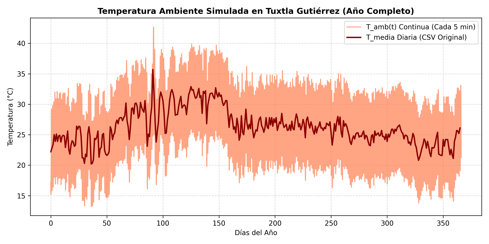
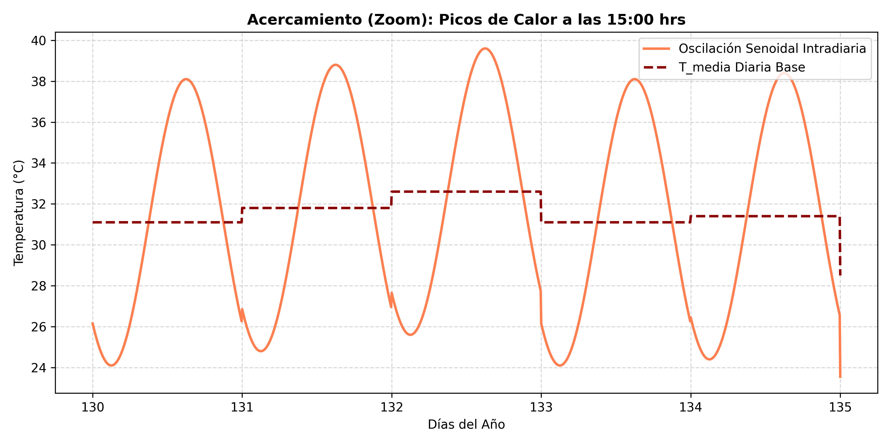
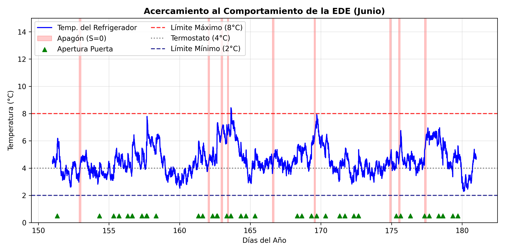
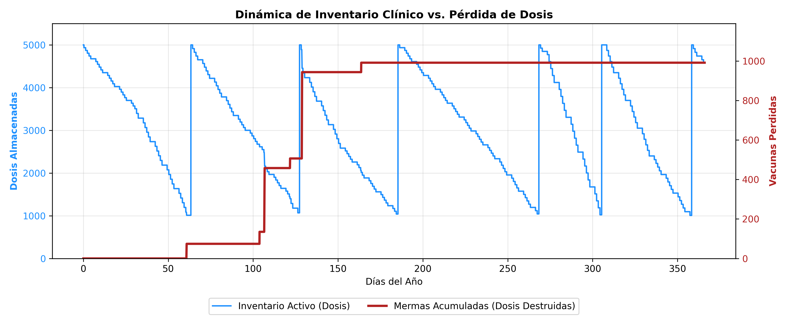
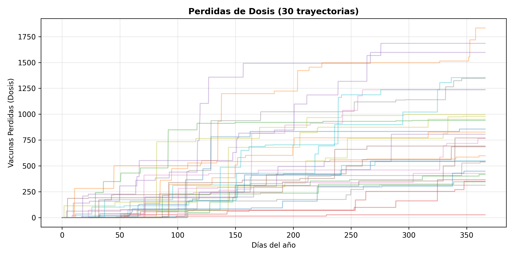
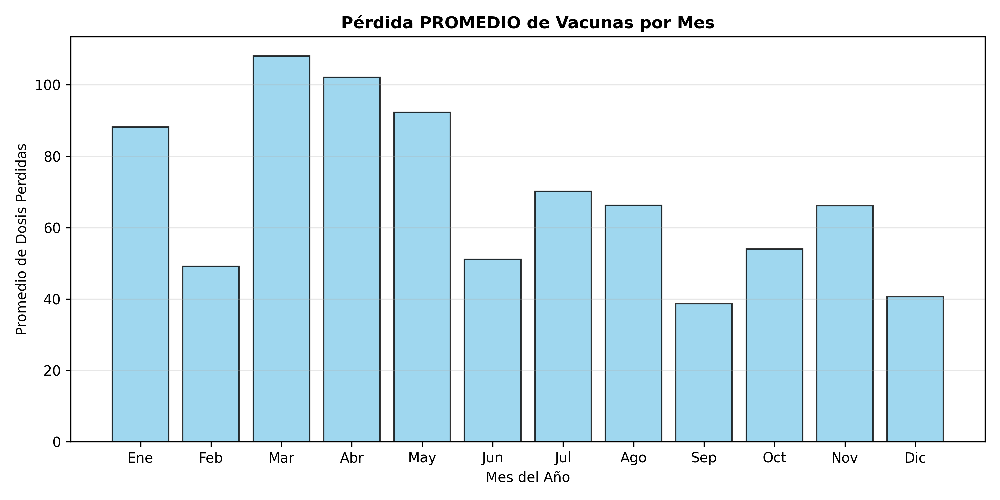
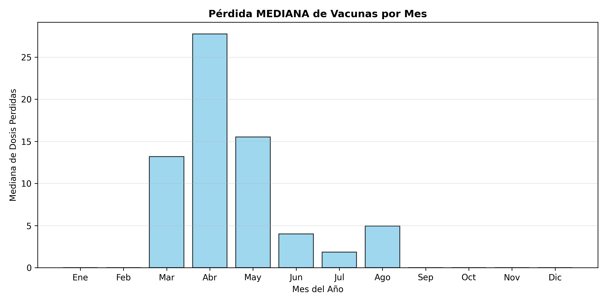
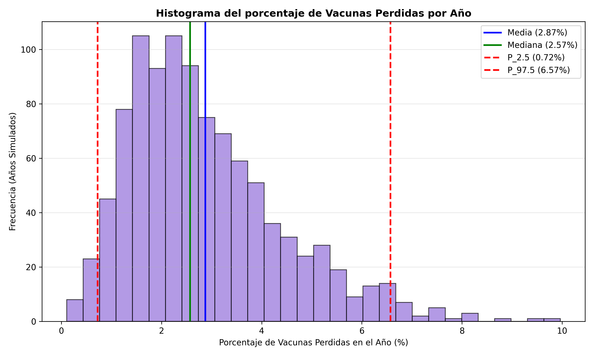

# Metodología de Simulación Computacional y Análisis Estadístico de Riesgo

Para evaluar la confiabilidad de la red de frío frente a la volatilidad del suministro eléctrico y las condiciones climáticas de Tuxtla Gutiérrez, Chiapas, desarrollamos un simulador estocástico en Python enfocado en el refrigerador institucional Haier HBC-150 presentado en la sección anterior. Debido a la interacción de múltiples procesos aleatorios inesperados (cortes de energía de CFE, aperturas de puerta y variaciones extremas de temperatura), el sistema no posee una solución matemática analítica cerrada. En consecuencia, recurrimos a la integración numérica de trayectorias acoplada al método de Montecarlo.

> **Nota sobre Reproducibilidad:** Con el fin de mantener este reporte de investigación con un formato académico limpio y legible, hemos omitido el código fuente de programación. El script completo se encuentra documentado detalladamente en el repositorio público de GitHub de este proyecto [@CPG2026Delfin].

A continuación, exponemos detalladamente el diseño metodológico de la simulación estructurado según el orden lógico de las celdas del algoritmo computacional, seguido de la discusión profunda de los resultados obtenidos.

## 1. Procesamiento Temporal y Entorno Climático

El primer módulo de la simulación constituye el eje central del sistema. Definimos una malla de tiempo continua para cubrir un año completo ($366$ días, contemplando el año bisiesto 2024). Para capturar las microfluctuaciones de la temperatura interna del refrigerador, seleccionamos un paso de integración discreto de exactamente 5 minutos ($\Delta t = 5/60$ horas), lo que genera un total de $105408$ iteraciones por cada trayectoria anual simulada.

Para acoplar con la logística institucional, programamos un calendario interno que identifica los días hábiles (lunes a viernes) y los fines de semana (sábados y domingos), debido a que la extracción de vacunas ocurren exclusivamente en jornadas laborales.

Primero cargamos la base de datos meteorológicos reales de Tuxtla Gutiérrez. No obstante, las bases de datos públicas solo proveen la temperatura promedio diaria ($T_{media}$), ocultando el estrés térmico entre días. Para solucionar, expandimos el vector diario a la escala de 5 minutos mediante una función armónica (onda senoidal) con una amplitud térmica calibrada de $7^\circ\text{C}$ (equivalente a una oscilación típica de 14°C entre la madrugada y la tarde chiapaneca). Desfasamos el argumento del coseno por 15 horas para forzar que el pico de calor sea a las 15:00 horas de cada día simulado:

$$
T_{amb}(t) = T_{media}(t) + 7.0 \cdot \cos\left(2\pi \frac{t - 15}{24}\right)
$$

La validación visual de la oscilación de la temperatura ambiente se presenta en la @fig-clima-anual, que exhibe el comportamiento anual, y en la @fig-clima-zoom, que demuestra la consistencia del ciclo diurno continuo.

{#fig-clima-anual}

{#fig-clima-zoom}

## 2. Parametrización Física, Cinética y Estocástica de la Red

Una vez construido el entorno temporal y climático, procedemos a inicializar las constantes que controlan las fuerzas físicas del refrigerador Haier HBC-150 y las propiedades biológicas de las vacunas.

### Parámetros Termodinámicos y Cinéticos del Equipo
Asignamos los coeficientes térmicos constantes previamente estimados para el modelo de Ornstein-Uhlenbeck (EDE). Cuando el equipo cuenta con electricidad, la tasa de abatimiento térmico se fija en $\kappa_{on} = 0.1188\,\text{hr}^{-1}$ con una volatilidad interna de los ventiladores de $\sigma_{on} = 0.325$, obtenidos con los calculos de la sección anterior @sec-regimen-1. Ante un escenario de falla eléctrica, el compresor se apaga y el aislamiento de alta densidad del equipo (reforzado por sus paquetes de hielo internos) frena la transferencia de calor, lo que se modela con una inercia pasiva sumamente lenta de $\kappa_{off} = 0.00178\,\text{hr}^{-1}$ y un ruido por microfiltraciones de aire de $\sigma_{off} = 0.05$, estimado en la @sec-regimen-2. La temperatura objetivo del termostato se establece en $\theta = 4.0^\circ\text{C}$ y el equipo arranca en esta misma condición inicial ($T_0 = 4.0^\circ\text{C}$).

Para modelar la degradación biológica, configuramos las constantes de la ecuación de Arrhenius @eq-Arrhenius para un biológico termosensible genérico (perfil biológico representativo de vacunas vivas atenuadas como Sarampión o Poliomielitis). La energía de activación crítica se establece en $E_a = 85,000\,\text{J/mol}$ ($85\,\text{kJ/mol}$), la constante universal de los gases en $R = 8.314\,\text{J/(mol}\cdot\text{K)}$ y el factor de frecuencia preexponencial en $A = 1.2 \times 10^{14}$, estos parámtros se obtuvieron de la @sec-Arrhenius. 

Finalmente, programamos la lógica operativa para las aperturas de puerta durante las jornadas de consulta (lunes a viernes). Para aproximarnos a la realidad clínica, dividimos este comportamiento operativo en dos reglas independientes:

a) **Regla Matutina (Determinista):** Se programa una apertura fija y obligatoria exactamente a las 8:00 AM, momento en el que el personal de enfermería extrae los lotes de vacunas que se utilizarán en la jornada matutina.

b) **Regla Vespertina (Estocástica):** Entre las 15:00 y las 17:00 horas (horario de cierre y resguardo), se activa una tasa de probabilidad basada en un proceso de Poisson con una intensidad de $\lambda_{tarde} = 0.5$ aperturas por hora, en proporción a la longitud del horario vespertino, modelando asi las aperturas aleatorias para almacenar los frascos sobrantes. Cada evento de apertura incrementa instantáneamente un salto térmico constante de $\gamma = +1.0^\circ\text{C}$ al interior del equipo. Ambas reglas dejan de funcionar por completo si el indicador de fin de semana es verdadero.

### Parámetros Estocásticos de Fallas de la CFE
El riesgo externo del suministro eléctrico se parametriza mediante el comportamiento histórico de fallas de la Comisión Federal de Electricidad (CFE) en la región Sureste. Retomando los calculos de la @sec-ppnh, programamos la tasa de fallas diarias $\lambda_{cfe}(t)$ como un Proceso de Poisson No Homogéneo, donde combinamos un riesgo base de fallas locales ($0.0667$ cortes/día) con dos campanas gaussianas estacionales que modelan los picos de cortes debidos al sobrecalentamiento de transformadores en verano (centrada en el día 152) y la temporada de tormentas tropicales (centrada en el día 244):

$$
\lambda_{cfe}(t) = 0.0667 + 0.2333 \cdot \exp\left(-\frac{(t - 152)^2}{3200}\right) + 0.2333 \cdot \exp\left(-\frac{(t - 244)^2}{1800}\right).
$$

Para la duración de dichos cortes, incorporamos los parámetros de escala y forma ($\mu$ y $\sigma$) de una distribución Log-Normal calibrada por el método de los momentos para tres estaciones del año, usando para su estimación los datos históricos: temporada base ($\mu = 0.7933, \sigma = 0.6838$), temporada de estrés por calor ($\mu = 0.8529, \sigma = 0.2485$) y temporada de lluvias de alta intensidad ($\mu = 0.4667, \sigma = 0.3371$).

## 3. Precalibración Vectorizada de Eventos Externos

Antes de ponernos a resolver la ecuación diferencial estocástica de la temperatura, el algoritmo ejecuta un módulo de precalculabilidad vectorizada para optimizar los tiempos de cómputo. En esta fase, el programa simula de manera independiente las variables externas que afectarán al refrigerador a lo largo del año de prueba.

Para el suministro eléctrico, el algoritmo recorre secuencialmente los 366 días del año. Para cada día, consultamos la intensidad estacional de la CFE y realizamos un muestreo aleatorio de Poisson para determinar cuántas fallas eléctricas ocurrirán en esa jornada. Si el resultado es mayor a cero, el algoritmo selecciona una hora de inicio distribuida de manera uniforme entre las 0 y las 24 horas de ese día, y realiza un muestreo Log-Normal condicionado a la fecha para determinar la duración del corte en horas. Con estos datos, el algoritmo calcula los índices temporales correspondientes y modifica el vector de estado eléctrico $S(t)$, cambiando su valor de 1 (hay energía electrica) a 0 (no hay energía electrica) durante el intervalo afectado.

Para las aperturas de la puerta del refrigerador, el algoritmo genera un vector binario de eventos evaluado en el dominio de tiempo discreto $t \in \{0, \Delta t, 2\Delta t, \dots, 8784\}$ horas. Dado que el paso de integración se fijó en $\Delta t = 5/60$ horas (es decir 5 minutos), este conjunto se particiona exactamente en $105408$ iteraciones para cubrir la totalidad del año. Este vector se construye combinando la apertura de las 8:00 AM con un muestreo de Poisson ejecutado sobre la tasa de intensidad de la tarde ($\lambda_{tarde} \cdot \Delta t$).

Posteriormente, el algoritmo aplica una regla estricta de control sanitario: multiplica el vector de aperturas por la función de estado eléctrico $S(t)$, donde la variable de entrada $t$ en $S(t)$ se mueve exactamente en el mismo intervalo discreto de $[0, 8784]$ horas. Esto garantiza que si la central de almacenamiento de vacunas se encuentra bajo un apagón en un instante específico ($S(t)=0$), la probabilidad de apertura en ese mismo $t$ se reduce a cero de forma absoluta, reflejando el protocolo médico real que prohíbe abrir el refrigerador si no hay energía para evitar la pérdida acelerada de frío.

Finalmente, los eventos válidos se multiplican por la magnitud del impacto térmico ($\gamma = 1.0^\circ\text{C}$) para terminar el vector discreto temporal de saltos térmicos ($Saltos\_Termicos(t)$).

En el año de prueba inicial con semilla controlada, la simulación arrojó que hay **68 apagones** y un total de **508 aperturas de puerta** hechas por el personal clínico.

## 4. Resolución de la SDE

Con todos los vectores de perturbaciones externas precalculados, se procede a ejecutar el núcleo analítico del modelo, resolviendo la evolución de la temperatura interna y su impacto directo sobre el lote de vacunas.

### Integración de la Temperatura por Cambios de Régimen
Para avanzar en el tiempo, el algoritmo recorre la iteración $i$ en el intervalo $i \in [1, 105407]$. El índice arranca en 1 y no en 0 porque el primer valor de la matriz corresponde a la condición inicial ya conocida de la temperatura interna del refrigerador ($T_0 = 4^\circ\text{C}$). En cada iteración $i$, evalúa el estado del suministro eléctrico en el paso previo ($S_{t}[i-1]$), activando un cambio de régimen dinámico (*regime-switching*). Si el suministro está activo, aplica los parámetros de convección forzada ($\kappa_{on}, \sigma_{on}$) llevando a la temperatura hacia la temperatura ideal ($\theta = 4.0^\circ\text{C}$) y le suma el salto térmico si la puerta fue manipulada. Si el suministro está apagado, el algoritmo desactiva los ventiladores y acopla la inercia térmica pasiva ($\kappa_{off}, \sigma_{off}$), provocando que la temperatura del refrigerador sea atraída hacia la temperatura ambiente exterior de Tuxtla Gutiérrez ($T_{amb}[i-1]$).

La solución numérica se ejecuta mediante el esquema de Euler-Maruyama desarrollado en la @sec-euler-maruyama. Es fundamental destacar que, dado que las volatilidades térmicas ($\sigma_{on}$ y $\sigma_{off}$) actúan como ruidos aditivos constantes independientes del estado de la temperatura $X(t)$, sus derivadas parciales respecto al estado son nulas ($\frac{\partial \sigma}{\partial x} = 0$). Debido a esta propiedad del cálculo estocástico, el término de corrección de segundo orden del método de Milstein se multiplica por cero y desaparece por completo, demostrando que el esquema de Milstein se reduce de forma exacta al método de Euler-Maruyama aquí empleado.

Simultáneamente, el ciclo evalúa el daño térmico acumulado mediante la ecuación de Arrhenius. Si la temperatura interna del refrigerador supera el límite normativo de seguridad ($X_{t}[i] > 8.0^\circ\text{C}$), el algoritmo convierte la temperatura a grados Kelvin, calcula la constante cinética instantánea $k(t)$ y actualiza la viabilidad de la vacuna ($V_t$) aplicando un decaimiento exponencial dependiente de $\Delta t$. Si la temperatura se mantiene a salvo dentro del rango seguro, la viabilidad farmacológica permanece congelada en su valor previo. La dinámica resultante para el año completo se expone en la @fig-sde-anual, mientras que la @fig-sde-zoom presenta un acercamiento exclusivo al mes crítico de junio.

{#fig-sde-anual}

{#fig-sde-zoom}

### Integración de la Dinámica Logística de Inventario y Mermas
Para pasar de una pérdida de viabilidad teórica a pérdidas de vacunas, acomodamos la simulación al inventario físico real del equipo ($I_t$). El algoritmo avanza iteración por iteración en una escala de tiempo de 5 minutos, utilizando tres características logísticas clave:

1. **Consumo Mensual Estacional:** Si el reloj de la simulación marca exactamente las 8:00 AM en un día hábil, el algoritmo resta la demanda diaria asignada a ese mes (ej. 65 dosis en meses regulares, aumentando a 163 dosis en octubre por Influenza).
2. **Penalización por Merma Instantánea:** En ese mismo paso de tiempo, si la temperatura supera los 8°C, el algoritmo extrae la fracción de pérdida calculada por la ecuación de Arrhenius ($1 - \exp(-k_t \cdot \Delta t)$) y se multiplica por el número exacto de vacunas almacenadas en el refrigerador en ese instante. El resultado representa las dosis perdidas, las cuales son restadas del inventario activo y acumuladas en un vector de mermas acumuladas.
3. **Reabastecimiento Automático:** Si el inventario cae por debajo del stock de seguridad o punto de reorden ($1,000$ dosis), se simula la llegada instantánea del camión de distribución, el cual recarga el equipo hasta su capacidad máxima de $5,000$ dosis. El algoritmo registra la cantidad exacta de dosis entregadas en la variable `total_dosis_ingresadas` para calcular con precisión la tasa de pérdida global al final de la simulación. La interacción de esta logística con las mermas físicas se visualiza en la @fig-inventario-mermas.

{#fig-inventario-mermas}

## 5. Estructura de la Simulación Montecarlo

Con el fin de obtener validez científica y no depender del escenario de una sola simulación, empaquetamos el algoritmo completo dentro de la función `simular_un_ano(semilla)`. Para optimizar drásticamente la velocidad de ejecución en Google Colab y permitir análisis masivos, vectorizamos la generación del ruido browniano creando el arreglo global de variables normales `dW_vec` al inicio de la función.

Invocamos esta función dentro de un bucle de **Montecarlo con 1,000 simulaciones independientes**, asignando en cada iteración una semilla de aleatoriedad indexada (`semilla = sim + 42`). Al correr 1,000 años simulados, el algoritmo elimina las fluctuaciones extremas de los escenarios individuales y permite que actúe la **Ley de los Grandes Números** [@ross2018first]. Esto provoca que las métricas de control se estabilicen firmemente en promedios realistas: el simulador reportó un promedio global de **64.0 apagones por año** (alineado con los datos meteorológicos de la zona de Tuxtla Gutiérrez, Chiapas de la CFE) y un promedio de **515 aperturas de puerta anuales**, validando el comportamiento del personal clínico y la infraestructura eléctrica de entrada.

## 6. Resultados Estadísticos y Riesgo Operativo

Después de simular las 1,000 trayectorias de Montecarlo, procedemos a realizar el análisis de inferencia estadística para determinar el verdadero nivel de riesgo al que están expuestas las vacunas en Tuxtla Gutiérrez.

El comportamiento de los daños acumulados se aprecia con claridad en las trayectorias aleatorias presentadas en la @fig-abanico. El comportamiento de las curvas demuestra que el riesgo no es lineal; la tendencia de la merma anual depende estrictamente de la coincidencia temporal entre la duración de un apagón de la CFE y el nivel de saturación del almacenamiento de vacunas en ese día específico del año.

{#fig-abanico}

Al desglosar las pérdidas de dosis de forma mensual, los datos revelan el verdadero comportamiento del riesgo operativo a lo largo del año, expuesto en la @fig-barras-promedio (Promedio mensual) y en la @fig-barras-mediana (Mediana mensual). 

Inicialmente, desde un punto de vista puramente logístico, se podría pensar que los meses de otoño (octubre y noviembre) presentarían la mayor cantidad de vacunas perdidas, debido a que en esa temporada el refrigerador opera a su máxima capacidad por el arranque de la campaña nacional invernal contra la Influenza. Sin embargo, la simulación muestra que **el factor termodinámico y eléctrico domina por completo al volumen de inventario.** Tanto el promedio como la mediana revelan que **el verdadero pico de pérdidas materiales se concentra severamente en la temporada de calor extremo: marzo, abril y mayo.**

Durante este trimestre, Tuxtla Gutiérrez experimenta sus temperaturas ambientales máximas. Este calor extremo genera un doble impacto en el sistema: por un lado, dispara el estrés sobre la infraestructura de la CFE (debido al uso masivo de aires acondicionados en la ciudad), provocando la mayor tasa de apagones por sobrecalentamiento de transformadores; por otro lado, reduce drásticamente el tiempo de autonomía pasiva del refrigerador apagado, acelerando la cinética de degradación de Arrhenius de las vacunas. 

En el gráfico de promedios, estos tres meses resultan casi idénticos en su alto nivel de destrucción, confirmando que la primavera es la temporada crítica. Al observar la métrica de la mediana (estadísticamente más robusta porque aísla los años atípicamente catastróficos), el mes de **abril** sobresale como el periodo donde la pérdida de vacunas es superior a la de los otros meses. Queda comprobado que la red de frío chiapaneca es altamente vulnerable al choque térmico primaveral, superando cualquier riesgo derivado de la saturación logística de otras temporadas.   

::: {#layout-barras layout-ncol=2}
{#fig-barras-promedio}

{#fig-barras-mediana}
:::

Finalmente, para estandarizar el riesgo sin importar la escala de la unidad médica, transformamos las dosis destruidas en porcentajes relativos respecto al volumen total de vacunas manejadas por el equipo en el año. Al hacer las 1,000 simulaciones, el algoritmo arrojó el histograma presentado en la @fig-histograma-final. La distribución presenta una asimetría positiva (cola estirada hacia la derecha), comportamiento típico de los sistemas de riesgo operativo expuestos a fallas intermitentes severas.

**Los estadísticos descriptivos e inferenciales del modelo revelan que:**

* La **mediana de mermas** anuales se ubica en **751 dosis**, lo que representa una tasa de pérdida del **2.57%** de los lotes administrados.
* El **promedio de mermas** anuales se eleva a **827 dosis** (tasa del **2.87%**), el cual es mas alto por la presencia de años atípicamente catastróficos en la cola de la distribución.
* El **Value at Risk (VaR) al 95% de confianza** (riesgo severo) advierte que los centros de almacenamiento de vacunas se enfrentan a escenarios extremos donde se perderán hasta **1,736 dosis** en un solo refrigerador institucional.

A partir de los percentiles del histograma, podemos concluir con un **95% de nivel de confianza (Intervalo de Predicción)** que un centro de almacenamiento de vacunas en Tuxtla Gutiérrez, operando con un equipo normado por la OMS de última generación (Haier HBC-150), **sufrirá una pérdida inevitable de entre el 0.72% y el 6.57% de su inventario anual** debido a las condiciones climáticas locales y las condiciones eléctricas.

{#fig-histograma-final}